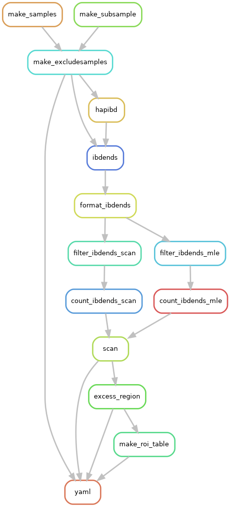
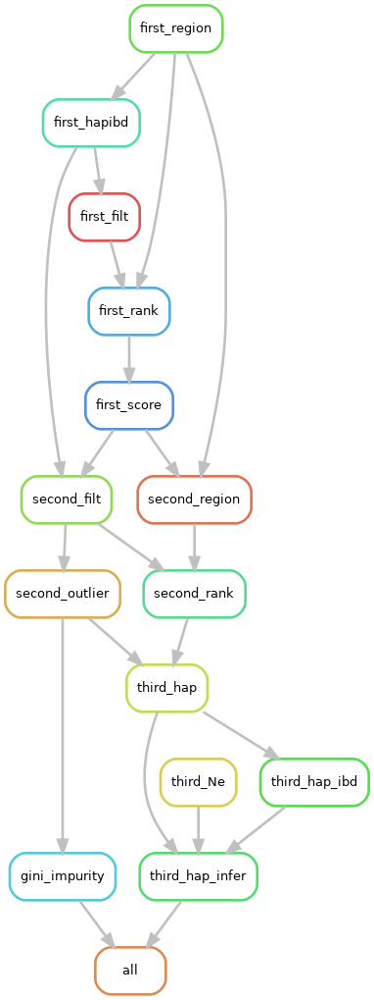

# Statistical inference using long IBD segments


BRANCHING AND MAKING UPDATES IN JULY 2024

NEW FEATURES AS A PART OF THIRD THESIS PROJECT

See `misc/announcements.md` for high-level updates on this repo.

See `misc/fixes.md` for any major bug fixes.

See `misc/usage.md` to evaluate if this methodology fits your study.

See `misc/cluster-options.md` for some suggested cluster options to use in pipelines.

See on GitHub "Issues/Closed" for some comments **I/Seth** left about the pipeline. 

## Citation

Please cite if you use this package.

#### Methods to model selection:

Temple, S.D., Waples, R.K., Browning, S.R. (2023) "Modeling recent positive selection in Americans of European ancestry"
https://www.biorxiv.org/content/10.1101/2023.11.13.566947v1

#### Methods to simulate IBD segments and our central limit theorems:

Temple, S.D., Thompson, E.A. (2024) "Identity-by-descent in large samples" https://www.biorxiv.org/content/10.1101/2024.06.05.597656v1

#### Multiple testing correction for selection scan

PhD dissertation at University of Washington

Temple, S.D. (2024) "Statistical inference using identity-by-descent segments"


## Methodology

Acronym: *i*ncomplete *S*elective sweep *W*ith *E*xtended haplotypes *E*stimation *P*rocedure

This software presents methods to study recent, strong positive selection.
- By recent, we mean within the last 500 generations
- By strong, we mean selection coefficient s >= 0.015 (1.5%)

The methods relate lengths of IBD segments to a coalescent model under selection. 

We assume 1 selected allele at a locus.

### Our methods are implemented automatically in a `snakemake` pipeline:

1. A genome-wide selection scan for anomalously large IBD rates
<!-- - With multiple testing correction -->
2. Inferring anomalously large IBD clusters
3. Ranking alleles based on evidence for selection
4. Computing a measure of cluster agglomeration (Gini impurity index)
5. Estimating frequency and location of unknown sweeping allele
6. Estimating a selection coefficient
7. Estimating a confidence interval

### The input data is:

See `misc/usage.md`.

- Whole genome sequences
  - Probably at least > 500 diploids
  - Phased vcf data 0|1
  - No apparent population structure
  - No apparent close relatedness
  - A genetic map (bp ---> cM)
    - If not available, create genetic maps w/ uniform rate
  - Recombining diploid chromosomes
    - Not extended to human X chromosome
- Access to cluster computing
  - For human-scale data, you should have at least 25 Gb of RAM and 6 CPUs on a node.
    - More memory and cores for TOPMed or UKBB-like sequence datasets
  - Not extended to cloud computing

The chromosome numbers in genetic maps should match the chromosome numbers in VCFs.

The genetic maps should be tab-separated.

## Repository overview

This repository contains a Python package and some Snakemake bioinformatics pipelines.
- The package ---> `src/`
- The pipelines ---> `workflow/`

You should run all `snakemake` pipelines in their `workflow/some-pipeline/`.

You should be in the ```mamba activate isweep``` environment for analyses.

You should run the analyses using cluster jobs.

We have made README.md files in most subfolders.

## Installation

See `misc/installing-mamba.md` to get a Python package manager.

1. Clone the repository
``` 
git clone https://github.com/sdtemple/isweep.git 
```
2. Get the Python package
``` 
mamba env create -f isweep-environment.yml
```
```
mamba activate isweep
```
```
python -c 'import site; print(site.getsitepackages())'
```
3. Download software.
``` 
bash get-software.sh software 
```
  - Puts these in a folder called `software/`.
  - Requires `wget`.
  - For simulation study, download SLiM yourself.
    - Put in `software/`.
    - https://messerlab.org/slim/
  - You need to cite these software.

See `workflow/other-methods/` folder for how we run methods we compare to.

## Running the procedure:

This is the overall procedure. You will see more details for each step in `workflow/some-pipeline/README.md` files.

### Pre-processing

Phase data w/ Beagle or Shapeit beforehand.
Subset data in light of global ancestry and close relatedness.
- Here is a pipeline we built for these purposes: `https://github.com/sdtemple/flare-pipeline`
- You could use IBDkin to detect close relatedness: `https://github.com/YingZhou001/IBDkin`
- You could use PCA, ADMIXTURE, or FLARE to determine global ancestry. 

### Main analysis

1. Make pointers to large (phased) vcf files.
2. Edit YAML files in the different workflow directories.
3. Run the selection scan (`workflow/scan`).
``` 
nohup snakemake -s Snakefile-scan.smk -c1 --cluster "[options]" --jobs X --configfile *.yaml & 
```
  - See the file `misc/cluster-options.md` for support.
- Recommendation: do a test run with your 2 smallest chromosomes.
- Check `*.log` files from `ibd-ends`. If it recommends an estimated err, change error rate in YAML file.
- Then, run with all your chromosomes.
4. Estimate recent effective sizes :` workflow/scan/scripts/run-ibdne.sh `.
5. Make the Manhattan plot: ` workflow/scan/scripts/manhattan.py `.
6. Checkout the `roi.tsv` file.
  - Edit with locus names if you want.
  - Edit to change defaults: additive model and 95% confidence intervals.
7. Run the region of interest analysis (`workflow/roi`).
``` 
nohup snakemake -s Snakefile-roi.smk -c1 --cluster "[options]" --jobs X --configfile *.yaml & 
``` 

## Picture of selection scan workflow

The flow chart below shows the steps ("rules") in the selection scan pipeline.

Diverting paths "mle" versus "scan" refer to different detection thresholds (3.0 and 2.0 cM).

See `dag-roi.png` for the steps in the sweep modeling pipeline.



<!-- ## Picture of selection modeling workflow

 -->

## Development things to do

- Add vignettes
- Add multiple testing correction
- Further simulation studies (maybe)
  - Test performance in dominance selection (sequence data)
  - Test performance in MAF >= 0.01 data
