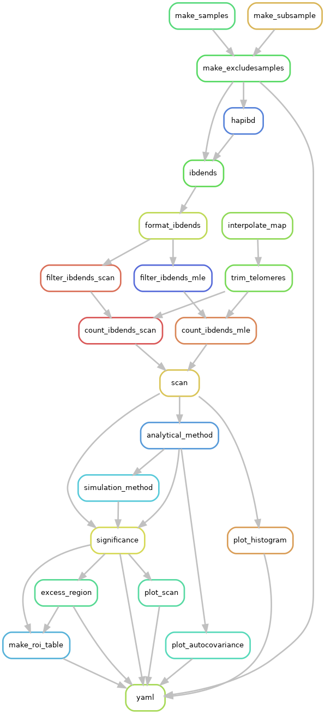

# Statistical inference using IBD segments

[](http://creativecommons.org/publicdomain/zero/1.0/)


**isweep** is a <a href="https://pypi.org/project/isweep/">Python package</a> and a series of automated workflows to study natural selection with identity-by-descent (IBD) segments. The Python package simulates IBD segments around a locus and estimates selection coefficients. The automated workflows perform selection scans, selection coefficient estimation, IBD case-control mapping, haplotype phasing, and local ancestry inference. Scripts in the workflows can be run individually in `scripts/`, with `argparse` documentation and inputs.

These methods are suitable for analyses for recent genetic/evolution events. For example,
- By recent, we mean within the last 500 generations.
- By strong, we mean selection coefficient s >= 0.015 (1.5%).
- Scan may have moderate power for s >= 0.01 (1%).

Please review the <a href="https://isweep.readthedocs.io/en/latest/index.html">Readthedocs</a> for detailed support, including which relevant publications to cite if you use this software.

Please file an Issue on GitHub for troubleshooting. 

Contact sethtem@umich.edu for support specific to your analysis, e.g., analyses of non-human genetic data.  

## The input data is:

- Whole genome sequences
  - Probably at least > 500 diploids
  - Phased vcf data 0|1 of recombining chromosomes
  - Tab-separated genetic map (bp ---> cM)
    - Without headers!
    - Columns are chromosome, rsID, cM, bp 
- Access to cluster computing

`workflow/phasing-ancestry` provides support for phasing and selecting an ancestry cohort.

## Primary pipelines:

The main workflows, `workflow/scan-selection` and `workflow/model-selection` do:

1. Scan genome for extreme IBD rates
2. Detect anomalously large IBD clusters
3. Rank alleles based on evidence for selection
4. Compute a cluster agglomeration measure
5. Estimate frequency, location of unknown sweeping allele
6. Estimate a selection coefficient (w/ CIs)

In general, you run workflows with
```
nohup snakemake -s Snakefile-*.smk -c1 --cluster "sbatch [options]" [options] --jobs XX --configfile *.yaml &
```
You modify the relevant YAML files, which define the method parameters. You should run the pipelines in the `mamba activate isweep` environment.

Step 1 may be standalone, depending on the analysis. (You may not care to model putative sweeps (Steps 2-6), which also requires demographic Ne estimation.)

## Installation

To install the dependencies and our package:

1. Clone the repository
``` 
git clone https://github.com/sdtemple/isweep.git 
```
2. Get the Python package
``` 
mamba env create -f isweep-environment.yml
```
3. Download some Java software.
``` 
bash get-software.sh 
```

You can test the workflows with our <a href="https://zenodo.org/records/14744019">small Zenodo repository</a>.

## Picture of selection scan

The flow chart below shows the steps ("rules") in the selection scan pipeline.


