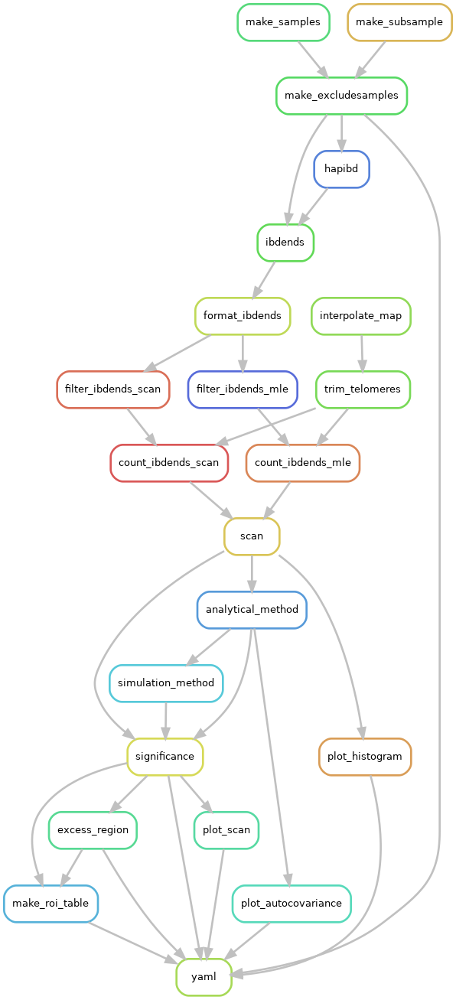

Usage
=====

You should always enter the ``isweep`` environment before running workflows: ``mamba activate isweep``.

The penultimate rule of all workflows is to copy the YAML parameters file to your analysis folder, supporting reproducibility and logging.

Most of the Python scripts under ``scripts/`` use ``argparse``. You can run them solo, with description and input support via ``python your-script.py --help``. For examples, see how scripts are run in the snakemake ``rules/``.

.. note::

   You should always run the workflows on cluster nodes with ``nohup snakemake [...] --cluster "sbatch [...]" &`` to manage submissions in the background. Jobs that are not ``localrules`` could take considerable RAM and time. See :ref:`snakemake-options` and :ref:`slurm-options`.

.. _selection-scan:

Selection scan
##############

The ``worfklow/scan-selection`` implements the IBD rate selection scan with two multiple-testing corrections. You should use the ``Snakefile-scan.smk`` file as input to the ``-s`` option.

Recipe YAML files to modify are ``sequence.yaml`` and ``array.yaml`` for WGS and SNP array data, respectively. There is a hierarchy of ``change`` versus ``fixed`` parameters, where ``change`` you should modify for your dataset and ``fixed`` you should reach out for advice.

The main command is 

.. code-block:: shell

   nohup snakemake -s Snakefile-scan.smk [...] --cluster "sbatch [...]" --jobs XX --configfile sequence.yaml

The parameters are:

* Many parameters under ``files`` determine where your data is and where you want outputs to be.
* You can use ``chromosome_low`` and ``chromosome_high`` to determine a range of such to study. All chromosome ``.vcf.gz`` and ``.map`` must be numbered.
* ``subsample``: text file with sample IDs in VCF files, which can/likely is a subset of larger consortium dataset
* ``ibd_ends:error_rate``: set this from estimated error in pilot study of your smallest chromosomes (log files from `ibd-ends <https://github.com/browning-lab/ibd-ends/>`_ software)
* ``ploidy``: if your ploidy is not 1 or 2, see :ref:`ploidy-extension`
* ``step_size_cm``: you perform a hypothesis every X.XX centiMorgans
* ``scan_cutoff``: minimum length of detected IBD segments (recommended >= 2.0 or >= 3.0)
* ``confidence_level``: the family-wise error rate you want to control (e.g., 0.05)
* ``num_sims``: simulations to derive one of the multiple-testing corrections
* ``chromosome_exclude``: empty, or a text file with chromosome numbers to not analyze

.. note::

   Chromosomes smaller that the centiMorgan parameter ``fixed:isweep:chromosome_size_cutoff`` will not be analyzed. You cannot reliably estimate the autocovariance decay of IBD rates in mini chromosomes. The default is 25 cM.


The outputs are:

* ``scan.png``: the IBD rates along autosomes and the estimated significance thresholds
* ``scan.modified.ibd.tsv``: the difference in IBD rates along the autosomes in tabular format
* ``autocovariance.png```: model fit for autocovariances of IBD rates
* ``zhistogram.png``: an empirical distribution of IBD rates (should look Gaussian)
* ``roi.tsv``: summary table of the genome-wide significant loci
* ``fwer.analytical.txt``: details about parameters and estimates for multiple testing
* ``chromosome-sizes-kept.tsv``: numbers and cM sizes of chromosomes analyzed
* ``ibdsegs/``: folder and subfolders with detected IBD segments

The main selection scan figure is:

.. image:: images/scan.png
   :align: center
   :width: 600px


|
|


Description of key columns in the ``scan.modified.ibd.tsv`` file:

* ``BPWINDOW``: base pair location 
* ``CMWINDOW``: centiMorgan location 
* ``COUNT``: number of overlapping IBD segments 
* ``Z``: standardized IBD rate 
* ``PVALUE``: the p value which is valid asymptotically
* ``UPPER``: an IBD count-based threshold
* ``Z_UPPER``: a standardized IBD rate-based threshold
* ``GW_LEVEL``: genome-wide significance threshold
* ``_ANALYTICAL``: discrete-spacing analytical approach
* ``_SIMULATE``: Ornstein-Uhlenbeck simulation-based approach 
* ``_CONTINUOUS``: continuous-spacing analytical approach (very conservative) 
* ``ADJ_MEAN``: mean IBD count 
* ``ADJ_STDDEV``: standard deviation of IBD count 

Description of columns in the ``roi.tsv`` file:

* ``NAME``: autogenerated locus name 
* ``CHROM``: chromosome number 
* ``MAXCOUNT``: maximum significant IBD count in the locus 
* ``MINCOUNT``: minimum significant IBD count in the locus
* ``BPCENTER``: base pair where the max IBD count is 
* ``CMCENTER``: centiMorgan where the max IBD count is 
* ``CMLEFT``: centiMorgan where the locus ends on the left 
* ``CMRIGHT``: centiMorgan where the locus ends on the right 
* ``BPLEFTCENTER``: same as ``CMLEFT`` except plus a buffer if locus is too small for hard sweep modeling
* ``MODEL``: autogenerated as additive genic selection for hard sweep modeling
* ``INTERVALCOVERAGE``: autogenerated as 95 percent confidence intervals for hard sweep modeling

.. note::

   The multiple-testing corrections are valid asymptotically (Temple and Thompson, 2024+). You can look at the IBD rate histogram to visually assess such (example below). Be wary of IBD rates being zero truncated in small samples.


|
|

.. note::

   You can look at the ``autocovariance.png`` files to see if the IBD rate decay fits the Ornstein-Uhlenbeck well.


|
|

.. note::

   There is a multiprocessing version using ``Snakefile-scan-mp.smk``, which may only be useful in enormous human biobanks.

.. _modeling-hard-sweeps:

Modeling hard sweeps
##############

The ``worfklow/model-selection`` estimates frequencies, locations, and selection coefficients of loci detected in the :ref:`selection-scan`. This workflow must be run after the selection scan. You should use the ``Snakefile-roi.smk`` file as input to the ``-s`` option.

The recipe YAML file to modify is ``sweep.yaml``. There is a hierarchy of ``change`` versus ``fixed`` parameters, where ``change`` you should modify for your dataset and ``fixed`` you should reach out for advice.

The main command is 

.. code-bloack:: shell

   nohup snakemake -s Snakefile-roi.smk [...] --cluster "sbatch [...]" --jobs XX --configfile sweep.yaml

The parameters are:

* Many parameters under ``files`` determine where your data is and where you want outputs to be.
* ``regions_of_interest``: these are the loci to analyse. The default are those GW significant in the scan. You can delete some, or rename the GW significant "hits".
* ``chromosome_prefix``: this is the name ``chr`` or blank that you see when you run ``bcftools query -f "%CHROM\n" chr.vcf.gz | head``.
* ``ploidy``: if your ploidy is not 1 or 2, see :ref:`ploidy-extension`
* ``Ne``: an estimate of recent effective population sizes (IBDNe text file format)

You can change the genic selection model in ``roi.tsv`` to "a" for additive, "m" for multiplicative, "d" for dominance, and "r" for recessive. You can also change alpha, which determines the (1-alpha) percent confidence intervals.

The script ``scripts/run-ibdne.sh`` runs IBDNe, which is good for populations with exponential growth. You may want to consider another Ne estimator as well.

.. code-block:: shell

   sbatch [...] run-ibdne.sh [ibdne-jar] [memory-in-Gb] [main-folder-of-study] [path-to-subfolder-with-ibd-data] [chromosome_low] [chromosome_high] [output_file] [random_seed]

The outputs are:

* ``summary.hap.norm.tsv``: sweep model estimates for best haplotype-based analysis and Gaussian confidence intervals for selection coefficient
* ``summary.snp.norm.tsv``: sweep model estimates for best SNP-based analysis and Gaussian confidence intervals for selection coefficient
* ``hit*/second.ranks.tsv.gz``: alleles with putative evidence for selection (or strong correlation with a selected allele)
* ``hit*/outlier*.txt``: files with sample haplotype IDs in clusters on excess IBD sharing

Description of columns in ``summary.*.*.tsv`` files:

* ``MAXCOUNT``: maximum IBD count from the selection scan
* ``INTERVALCOVERAGE``: The (1 - alpha) percent coverage of confidence interval (e.g. 95 percent)
* ``LOCHAT``: Base pair estimate of a putative sweeping allele
* ``COUNTIBD``: IBD count at the base pair estimate
* ``PHAT``: Sweeping allele frequency estimate
* ``SHAT``: Selection coefficient estimate
* ``CONF_INT_LOW``: If s in (A,B) is the confidence interval, this value is A
* ``CONF_INT_UPP``: If s in (A,B) is the confidence interval, this value is B 
* ``MODEL``: a for additive, m for multiplicative, d for dominance, r for recessive
* ``GINI_IMPURITY``: Gini impurity of the excess IBD sharing group
* ``NUM_OUTLIER_GROUPS``: number of disconnected clusters in excess IBD sharing group 
* ``PROP_IN_OUTLIER_GROUP``: fraction of sample haplotypes in excess IBD sharing group

.. note::

   The Gaussian bootstrap intervals are valid asymptotically (Temple and Thompson, 2024+). You can uncomment lines in ``rule all`` of the ``Snakefile-roi.smk`` to get percentile-based bootstrap intervals.


All of the IBD clusters are in the files ``communities.csv``. Each cluster is a comma-separated cluster with sample haplotype IDs. The ``_1`` and ``_2`` suffixes correspond to the haplotypes of a diploid individual.

.. note::

   If ``NUM_OUTLIER_GROUPS`` is more than a few, ``GINI_IMPURITY`` exceeds 0.6, or ``PROP_IN_OUTLIER_GROUP`` is less than 0.10, the significant locus may not be the result of a hard sweep 

Description of columns in ``second.ranks.tsv.gz`` files:

* ``POS``: marker location
* ``AAF``: allele frequency in entire sample 
* ``AAF1``: allele frequency in excess IBD sharing group
* ``AAF0``: allele frequency in the rest of the sample
* ``ZDELTA``: this value is ``AAF1`` minus ``AAF0`` divided by square root ``AAF`` times one minus ``AAF``
  
You can use the values in this table and the notebook ``scripts/model/telltale-v2.ipynb`` to make plots like below. The decay of intermediate frequencies is good evidence of a sweep.


   
|
|


.. _case-control-scan:

Case-control scan
##############

The ``worfklow/scan-case-control`` implements the difference in IBD rates scan with two multiple-testing corrections. You should use the ``Snakefile-case.smk`` file as input to the ``-s`` option.

You must run this workflow after the selection scan workflow (where the IBD segments are detected). You should scrutinize the results to see if strong selection confounds your case-control study.

The recipe YAML file to modify is ``case.yaml``. The parameters are nearly all the same as in :ref:`selection-scan`. The ``case`` parameter is a two-column text file with sample IDs and binary phenotypes.

The main command is 

.. code-block:: shell

   nohup snakemake -s Snakefile-case.smk [...] --cluster "sbatch [...]" --jobs XX --configfile case.yaml.

The outputs have the same nomenclature as in the selection scan workflow, but ``.case.`` and ``.control.`` is inserted in file names:

* ``scan.case.control.png``: the standardized difference in IBD rates along autosomes and the estimated significance thresholds
* ``scan.case.ibd.tsv``: the difference in IBD rates along the autosomes in tabular format 
* ``roi.case.tsv``: summary table of the genome-wide significant loci
* ``fwer.analytical.case.txt``: details about parameters and estimates for multiple testing


.. note::

   The multiple-testing corrections are valid asymptotically (Temple and Thompson, 2024+). You can look at the IBD rate histogram to visually assess such. Be wary of IBD rates being zero truncated in small samples. 

.. note::

   There is a multiprocessing version using ``Snakefile-case-mp.smk``, which may only be useful in enormous human biobanks.

You can try to detect clusters of cases or controls with excess IBD sharing GW significant loci using ``Snakefile-case-roi.smk`` and the template ``--configfile case.roi.yaml``. 

The output to this feature will be a tab-separated file with sample haplotype IDs, their binary phenotype, and indicators if they are in excess IBD sharing groups (``matrix.outlier.phenotypes.tsv`` for each hit). An example of this file is ``design.sorted.tsv``. You could perform regression analyses on these dataframes. Scripts ``scripts/utilities/fake-phenotypes-*.py`` can be used for testing and evaluating confounding from strong recent selection.

You can also look at the sample haplotype IDs in the ``hit*/outlier*.phenotype.tsv`` files.

.. note::

   I tested that ``Snakefile-case-roi.smk`` runs smoothly, but not if it works well at its task in a simulation study.

.. _phasing-and-ancestry:

Phasing and ancestry
##############

This ``worfklow/phasing-ancestry`` provides support for automated haplotype phasing (`Beagle <https://faculty.washington.edu/browning/beagle/beagle.html>`_), local ancestry inference (`Flare <https://github.com/browning-lab/flare>`_), and kinship inference (`IBDkin <https://github.com/YingZhou001/IBDkin>`_).

The main command is 

.. code-block:: shell

   nohup snakemake -s Snakefile-*.smk [...] --cluster "sbatch [...]" --jobs XX --configfile phasing-and-lai.yaml

The Snakefiles are:

* ``Snakefile-beagle-flare-gds.smk``: your data is stored as GDS files, and you want to phase as well as LAI and IBD inference
* ``Snakefile-beagle-flare-vcf.smk``: your data is stored as VCF files, and you want to phase as well as LAI and IBD inference
* ``Snakefile-flare-only-gds.smk``: your data is already phased in GDS files, and you want to perform LAI and IBD inference
* ``Snakefile-flare-only-vcf.smk``: your data is already phased in VCF files, and you want to perform LAI and IBD inference

The YAML example file is ``phasing-and-lai.yaml``. Most of the parameters are written exactly as the parameters in `Beagle <https://faculty.washington.edu/browning/beagle/beagle.html>`_, `Flare <https://github.com/browning-lab/flare>`_, or `hap-ibd <https://github.com/browning-lab/hap-ibd>`_. Other parameters define file locations. The remaining parameters are:

* ``rename-chrs-map-adx``, ``rename-chrs-map-ref``: harmonizes 9 vs chr9 in VCF CHROM column with genetic map. Files are in ``rename-chrs/``. The ``num-chrnum.txt`` means 9 is in the VCF column, but chr9 is in the genetic map column.   
* ``ref-panel-map``: tab-separated, headerless file with reference sample ID (column 1) and reference panel label (column 2)
* ``keep-samples``: the sample IDs to phase, LAI, and IBD infer, which may be a subset of a larger consortium dataset
* ``bcftools-parameters:c-min-mac``: minimum minor allele count, where 1 and 2 are incredibly difficult to phase

.. note::

   We strongly recommend against setting ``flare-parameter:probs`` equal to ``true``, which may create enormous file sizes and require a lot of RAM.

.. note::

   The output files are in ``gtdata/``, ``lai/``, and ``ibdsegs/``. Rephasing is unphasing the reference panel and phasing them again with all the admixed samples; reference phasing is using the existing phase of the reference panel. Rephasing takes longer and creates more disk memory. You can uncomment or comment these output files in the ``rule all`` of the Snakefile.

.. note::

   You can use ``run-ibdkin.sh`` (with `IBDkin <https://github.com/YingZhou001/IBDkin>`_), ``high-kinship.py``, and ``keep-one-family-member.py`` in ``scripts/pre-processing/`` to filter out close relatives, say kinship >= 0.125. These scripts are not documented, so I recommend copy and paste into an LLM and ask it what these do.


.. _snakemake-options:

Snakemake options
##############

I regularly use these options.

* ``-s``: point to the right Snakefile
* ``--configfile``: point to your parameters file
* ``--jobs``: how many jobs can queue at once
* ``--cluster "[sbatch ...]"``
* ``-n``: dry run to see what the workflow will run
* ``--latency-wait 200``
* ``--keep-going``
* ``-c1``

.. _slurm-options:

Slurm options
##############

I regularly use these options.

* ``--cpus-per-task``: you should max out the CPUs on a node
* ``--mem``: you should almost max out the memory on a node
* ``-e {rule}`` and ``-o {rule}``: many jobs will be run, so you should define file locations for stdout and stderr
* ``--job-name={rule}``
* ``--mail-type=END`` and ``mail-user``: careful to not send yourself too many emails
* ``--partition``

.. _testing-workflows:

Testing workflows
##############

There is a `Zenodo repository <https://zenodo.org/records/14744019>`_ with some small simulated data examples. The ``README.md`` file gives commands for how I made the test data, and how to run the workflows. Note that the YAML and commands are relative to my local paths, so you will need to modify the paths to your data.

You can first locally run the hard sweep estimation and case-control scan with the data I left in the Zenodo repository.

You can run the phasing and LAI workflow locally, and it will finish in less than 10 minutes, but I recommend using a cluster.

You should run the selection scan with cluster resources.

.. note::

   You are encouraged to test out the workflows if you have >= 500 samples.

.. _ploidy-extension:

Ploidy extension
##############

VCF files with more than 1 or 2 ploidy are minimally supported. The cheat code is to treat them like haploid VCFs for the software using ``scripts/utilities/ploidy-conversion.py``. Let sample 1 have the genotype 0|0|0|1. The script will convert this into 4 samples with a haplotype index appended and the genotypes 0, 0, 0, 1.

You may also need to ``bgzip`` the output files again, and ``tabix -fp bcf``. The output works immediately in the selection scan, but ``tabix``-ing can fail for the hard sweep estimation.

For nondiploidy, you should set ploidy to be 1 in all configuration files. For modeling hard sweeps, you should make sure that your Ne file is scaled by the ploidy. For example, if your Ne file is w.r.t. the number of tetraploids, you should multiply the discrete Ne's by 4. Moreover, the sweep model will assume the formulas for haploid genic selection.

I am not an expert in nondiploidy. This cheat code may not be reasonable for your data.

Other considerations
##############

* There is limited statistical power in the selection scan with high cM length thresholds (>= 4.0).
* For humans, using pedigree-based maps like the deCODE map are crucial for accurate IBD segment detection. Non-pedigree based maps may be suitable in non-humans, as long as the estimated recombination rates are accurate enough for IBD segment detection.
* The p values assume the null model in the scans. If the histograms are far from Gaussian, you should not trust the p values.
* The null model is that there is a genome-wide mean IBD rate. If there are apparently two or more subsets of chromosomes with a different mean IBD rate, you should run such subsets separately using ``chromosome_exclude`` in the YAML file.
* Be cautious about interpretation of results near centromeres, where IBD segment detection is difficult.
* You could analyze recombining sex chromosomes solo, but estimates of the genome-wide significance level will be noisy. You should give the chromosome a pseudo number, e.g., human chromosome X as chr23.
* You can use ``scripts/plotting/plot-sweep.py`` to make figures like those in Temple, Waples, and Browning (2024). The file assumes you use Gaussian-based intervals (``scripts/model/estimate-norm.py``).
* Parameters for Mb buffer, window and haplotype sizes and steps in ``sequence.yaml`` and ``sweep.yaml`` are based on 1 cM ~~ 1 Mb. You may want to scale these accordingly if your species has a very different recombination rate.

The Temple and Thompson conditions, under which the scan is asymptotically valid, are:

1. Sample size squared large relative to population size times cM length threshold (n^2 = o(Nw))
2. Scaled population size large relative to sample size (Nw = o(n))

The Gaussian model is often reasonable whenever sample size and scaled population size are large, even if the above conditions don't hold.

There is a generalization of the main Temple and Thompson CLT for flexible demographic scenarios, i.e., large recent effective population sizes. 

Potential errors
##############

* SLURM jobs may fail at the Beagle or ibd-ends steps because of RAM. Re-run with more resources.
* Make sure your VCF files are tab-indexed (``tabix -fp vcf [...]``)
* You are not in the ``mamba activate isweep`` Python environment. (Failure b/c you don't have some package.)
* Binary incompatibility with ``statsmodels`` in ``multiple-testing-analytica-*.py``. Run ``pip install --upgrade numpy statsmodels scipy pandas networkx matplotlib seaborn``.
* A locus fails at the ``rule first_rank`` in ``workflow/model-selection`` because no excess IBD sharing group exists
* Sometimes the `Browning Lab software <https://github.com/browning-lab/>`_ (JAR files) on GitHub gets corrupted. Ask Brian to recompile it, or recompile it yourself.
* Genetic maps have a header or are not tab-separated. Four column (PLINK style) genetics maps should be tab-separated and headerless. 
* Genetic maps and VCFs have different prefixes, e.g. chr7 versus 7 in CHROM column
* You are using Snakemake 8, or too old a version of Snakemake 7.
* "Error: Could not find or load main class ibdends.IbdEndsMain". Re-download the java files with ``rm -r software/`` and then ``bash get-software.sh``.
* Java class file is too old. The Flare Jan 24 version worked for JDK11, but I upgraded to JDK23 to get Flare Oct 24 version to run.

Reproducing paper results
##############

The tag v1.0 is closest to the code used in our publications. The scripts in the tag to simulate data with msprime and capture the IBD segments with tskibd are used in the Temple and Browning (2025+) publication.

.. note::

   The simulation study in ``workflow/simulate`` was used in Temple, Waples, and Browning (2024). The scripts are older versions of this software. I will provide minimal/some support if one wants to replicate our results or use our SLiM simulation scripts.

.. note::

   The branch ``bring_clues_update`` has ``workflow/other-methods`` for the comparisons in Temple, Waples, and Browning (2024).

Installing a fast package manager
##############

I like to use mamba from miniforge as my package manager.

.. code-block:: shell

    wget https://github.com/conda-forge/miniforge/releases/latest/download/Miniforge3-Linux-x86_64.sh
    bash Miniforge3-Linux-x86_64.sh
    mamba

If the mamba command does not work,

1. ``vim .bashrc`` 
2. Put in a line and save ``alias mamba="/path/to/miniforge3/bin/mamba``
3. ``source .bashrc``
4. Sign out and sign back in of terminal


Visualizing the workflows
##############

These are the rule graphs made by snakemake. The first plot is the selection scan. The second plot is phasing and local ancestry inference.



|
|


.. image:: images/phasing-lai-ibd-rulegraph.png
   :align: center
   :width: 600px

|
|