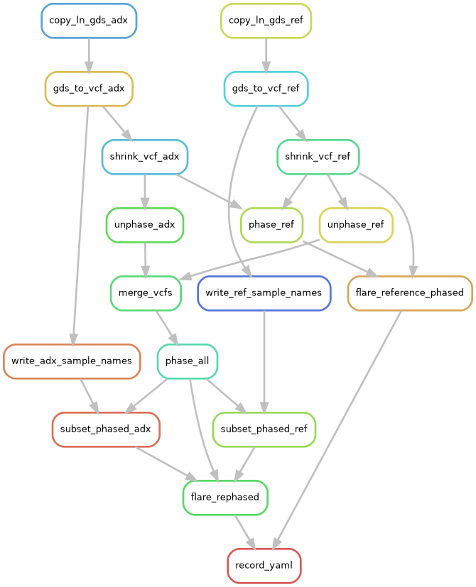

Visualizing workflows
=====

Here, I provide the rule graphs made by snakemake for the selection scan and the phasing and local ancestry inference.

Selection scan
##############

.. image:: images/scan-selection-rulegraph.png
   :align: center
   :width: 600px

|
|

Phasing and local ancestry
##############

|
|